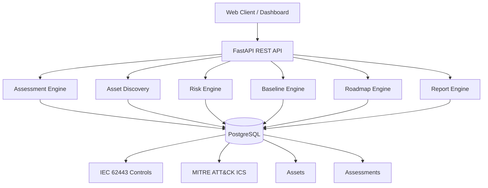

# 🛡️ Sentra OS

### AI-Powered OT Cybersecurity Assessment Platform

**Assess · Discover · Prioritize · Remediate**

Sentra OS is a modern OT cybersecurity platform that enables industrial organizations to assess cyber risk, discover industrial assets, manage IEC 62443 compliance and generate executive security reports from a single platform.


---

# Overview

Industrial organizations continue to face a common challenge: fragmented asset inventories, manual cybersecurity assessments, spreadsheet-based compliance tracking and disconnected reporting processes.

Sentra OS has been designed to centralize these activities into a single OT cybersecurity platform.

The platform enables industrial organizations, cybersecurity consultants and critical infrastructure operators to:

- Discover and inventory industrial assets.
- Assess cybersecurity posture using IEC 62443.
- Correlate risks with MITRE ATT&CK for ICS.
- Prioritize remediation actions based on business impact.
- Generate executive reports automatically.
- Build long-term cybersecurity roadmaps.

Rather than replacing existing OT security solutions, Sentra OS acts as an assessment and decision-support platform that helps organizations understand their current cybersecurity posture and continuously improve it.
---

# Current Release

## 🚀 Latest Stable Release

**Version:** v0.7.1

### Highlights

- ✅ Alembic Database Versioning
- ✅ Asset Discovery Engine
- ✅ Asset Risk Engine
- ✅ Asset Baseline Management
- ✅ Executive Reports
- ✅ Docker Deployment
- ✅ Render Cloud Deployment

**Release Notes**

https://github.com/ot-sec-lab-dev/sentra-os/releases/latest


# Key Features

## Assessment

- IEC 62443 Assessment Engine
- MITRE ATT&CK ICS Mapping
- Automated Risk Scoring
- Compliance Gap Analysis

## Asset Management

- Asset Discovery
- Asset Inventory
- Asset Risk Dashboard
- Baseline Management

## Reporting

- Executive Reports
- Remediation Roadmaps
- HTML Reports
- PDF Reports (Coming Soon)

## Platform

- REST API
- Docker Deployment
- PostgreSQL
- Alembic Database Versioning
- Render Cloud Deployment

## AI (Roadmap)

- Executive AI Summaries
- AI-assisted Risk Recommendations
- AI-generated Remediation Plans

---

# Platform Architecture



---

# Technology Stack

- Python 3.12
- FastAPI
- PostgreSQL
- SQLAlchemy
- Docker
- Docker Compose
- Jinja2
- Anthropic Claude API
- HTML Reporting

---

# Quick Start

## Clone the repository

```bash
git clone https://github.com/ot-sec-lab-dev/sentra-os.git
cd sentra-os
```

## Run with Docker

```bash
docker compose up --build
```

## API Documentation

Local:

```
http://localhost:8000/docs
```

Production:

```
https://sentra-os.onrender.com/docs
```


# Assessment Workflow

1. Create Assessment
2. Import Assets
3. Execute Interview
4. Calculate Risk Score
5. Generate Roadmap
6. Generate Executive Report
7. Export HTML / PDF

---

# Current Status

| Component | Status |
|-----------|--------|
| IEC 62443 Assessment Engine | ✅ Complete |
| Asset Discovery | ✅ Complete |
| Asset Risk Engine | ✅ Complete |
| Asset Baseline Engine | ✅ Complete |
| Executive Reports | ✅ Complete |
| HTML Reports | ✅ Complete |
| Docker Deployment | ✅ Complete |
| PostgreSQL | ✅ Complete |
| Alembic Migrations | ✅ Complete |
| Render Deployment | ✅ Complete |
| Authentication | 🚧 In Progress |
| Multi-Tenant Architecture | 🚧 In Progress |
| Executive Dashboard | 🚧 In Progress |
| AI Executive Summary | 🚧 In Progress |
| PDF Reports | 📅 Planned |
| Hercules Knowledge Engine | 📅 Planned |
| Threat Intelligence Integration | 📅 Planned |

---

# API Endpoints

| Endpoint | Description |
|----------|-------------|
| POST /assessments | Create Assessment |
| POST /interview | Execute Assessment |
| POST /risk-score | Calculate Risk |
| POST /report | Generate Report |

---

# Repository Structure

```
sentra-os/
│
├── app/
│   ├── main.py
│   ├── models.py
│   ├── db.py
│   └── modules/
│       ├── assessment_engine.py
│       ├── asset_discovery.py
│       ├── asset_risk_engine.py
│       ├── asset_baseline_engine.py
│       ├── asset_dashboard.py
│       ├── roadmap_engine.py
│       ├── report_engine.py
│       └── ai_engine.py
│
├── alembic/
│   └── versions/
│
├── db/
├── seed/
├── templates/
├── docker-compose.yml
└── README.md
```

---

# Product Roadmap

| Version | Status | Main Features |
|----------|--------|---------------|
| **v0.7.1** | ✅ Released | Alembic, Asset Dashboard, Baselines, Docker, Render |
| **v0.8** | 🚧 In Progress | Authentication, Organizations, Multi-Tenant Architecture |
| **v0.9** | 📅 Planned | Hercules Knowledge Engine, AI Recommendations, Executive Dashboard |
| **v1.0** | 🎯 Target | Complete OT Assessment Platform, PDF Reports, Compliance Dashboards, Threat Intelligence |

---

# Maintainer

**Juan José Calado**

OT Cybersecurity Engineer

Industrial Control Systems (ICS) • IEC 62443 • MITRE ATT&CK ICS • OT Risk Assessment • Industrial Asset Security

- GitHub: https://github.com/ot-sec-lab-dev
- LinkedIn: *(añadiremos el enlace en el siguiente sprint)*

---

# License

MIT License
